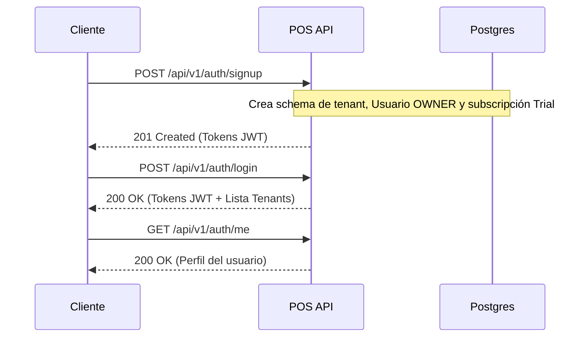
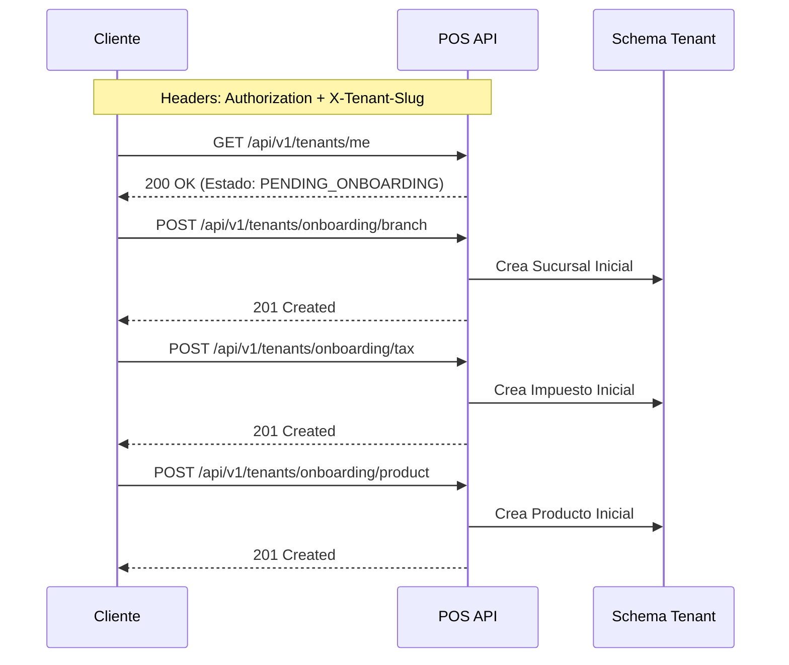
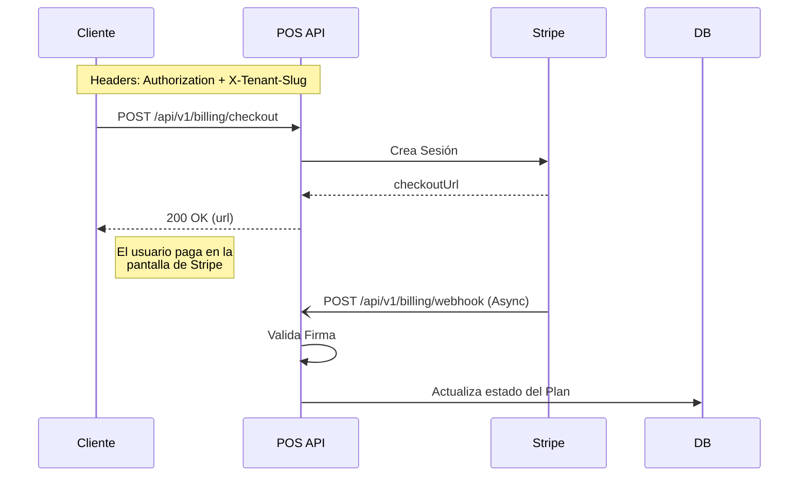

# POS SaaS - Flujo de Pruebas y Endpoints

Este documento describe el flujo operativo del sistema backend (API NestJS) y las acciones necesarias para probar la funcionalidad implementada: Autenticación, Onboarding Multi-Tenant y Facturación (Stripe).

## Entorno de Pruebas Rápidas (Swagger)

La API levanta automáticamente un portal de documentación interactiva Swagger.
Puedes usar esta UI para probar rápidamente los endpoints en desarrollo:

**URL de Swagger:** `http://localhost:3000/api/v1/docs`

> **Nota sobre autenticación en Swagger:** Para rutas protegidas, haz clic en el botón "Authorize" en Swagger e ingresa tu token JWT. Además, para los endpoints marcados con `@TenantRequired`, deberás incluir el `X-Tenant-Slug` en la configuración del endpoint en la UI de Swagger o se rechazará la petición.

---

## Arquitectura Multi-Tenant

El sistema requiere identificar de qué *tenant* (comercio) proviene cada petición en los módulos internos.

**Headers obligatorios para rutas protegidas internamente:**
- `Authorization: Bearer <accessToken>`
- `X-Tenant-Slug: <slug-del-comercio>` (ej: `mi-comercio`)

**¿De dónde saco el `X-Tenant-Slug`?**
Lo defines tú mismo al crear tu cuenta en el paso 1 (el campo `"tenantSlug"` del body en `/auth/signup`). También puedes verlo listado al hacer `GET /api/v1/auth/me` bajo la propiedad `tenants[0].slug`.

**¿Cómo lo envío?**
- **En Swagger:** Haz clic en el botón verde **"Authorize"** (arriba a la derecha). Verás dos cajas: una para tu token (`access-token`) y otra llamada `tenant-slug`. Pega tu slug allí y Swagger lo enviará automáticamente como header en cada prueba que hagas.
- **En Postman / Insomnia:** Ve a la pestaña "Headers" de tu petición, agrega una nueva fila con Key: `X-Tenant-Slug` y Value: el nombre de tu slug (ej. `mi-comercio`).

*(Alternativamente, en el código de producción, el sistema detecta el tenant automáticamente por el subdominio: `mi-comercio.localhost:3001` sin necesidad de este header)*

---

## 1. Flujo de Autenticación y Alta (Auth)

El primer paso es registrar un nuevo comercio. Esto creará el esquema aislado en PostgreSQL, el usuario propietario (`OWNER`) y una suscripción *Trial*.



### Acciones y Endpoints a probar:

1. **Alta de comercio (Signup)**
   - **Endpoint:** `POST /api/v1/auth/signup`
   - **Body (JSON):**
     ```json
     {
       "email": "admin@comercio.com",
       "password": "Password123!",
       "tenantSlug": "mi-comercio",
       "tenantName": "Mi Comercio"
     }
     ```
   - **Resultado:** Retorna `accessToken` y `refreshToken`. Toma nota del token y del `tenantSlug`.

2. **Login (Para reingresar)**
   - **Endpoint:** `POST /api/v1/auth/login`
   - **Body:** `{ "email": "admin@comercio.com", "password": "Password123!" }`

3. **Verificar perfil de usuario**
   - **Endpoint:** `GET /api/v1/auth/me`
   - **Headers requeridos:** `Authorization: Bearer <accessToken>`

---

## 2. Flujo de Onboarding del Tenant

Un comercio recién creado comienza en estado `PENDING_ONBOARDING`. Debe configurar parámetros iniciales antes de poder operar (sucursal, impuesto y producto).



### Acciones y Endpoints a probar:
*(Recuerda enviar SIEMPRE los headers `Authorization` y `X-Tenant-Slug` en estos endpoints)*

1. **Crear Sucursal Inicial**
   - **Endpoint:** `POST /api/v1/tenants/onboarding/branch`
   - **Body:**
     ```json
     {
       "name": "Sucursal Central",
       "code": "CEN01",
       "address": "Av. Principal 123",
       "timezone": "America/Argentina/Buenos_Aires"
     }
     ```

2. **Crear Impuesto Inicial (ej. IVA)**
   - **Endpoint:** `POST /api/v1/tenants/onboarding/tax`
   - **Body:**
     ```json
     {
       "name": "IVA 21%",
       "rate": 0.21,
       "type": "PERCENT"
     }
     ```

3. **Crear Producto Inicial**
   - **Endpoint:** `POST /api/v1/tenants/onboarding/product`
   - **Body:**
     ```json
     {
       "name": "Producto de Prueba",
       "sku": "PRUEBA-01",
       "price": 1500,
       "trackStock": true
     }
     ```

4. **Verificar Estado del Tenant**
   - **Endpoint:** `GET /api/v1/tenants/me`
   - **Resultado:** Tras completar los 3 pasos, internamente el sistema sabe que el comercio ya ha completado su Onboarding inicial.

---

## 3. Flujo de Suscripción (Billing / Stripe)

La API se integra con Stripe para la gestión de pagos (Checkout) y modificación de tarjetas (Customer Portal).



### Acciones y Endpoints a probar:

1. **Generar Link de Pago (Checkout)**
   - **Endpoint:** `POST /api/v1/billing/checkout`
   - **Body:** `{ "planId": "growth" }`
   - **Acción:** Retornará una URL que te llevará al flujo simulado de Stripe para introducir una tarjeta de prueba.

2. **Portal de Cliente de Stripe (Gestión de método de pago)**
   - **Endpoint:** `GET /api/v1/billing/portal`
   - **Acción:** Retornará una URL para el portal en donde el cliente puede modificar su tarjeta de crédito o cancelar su suscripción.

3. **Webhook de Stripe (Interno)**
   - **Endpoint:** `POST /api/v1/billing/webhook`
   - **Acción:** Este endpoint recibe los eventos desde Stripe. En local, puedes probarlo usando el CLI de Stripe para redirigir los eventos (`stripe listen --forward-to localhost:3000/api/v1/billing/webhook`).
