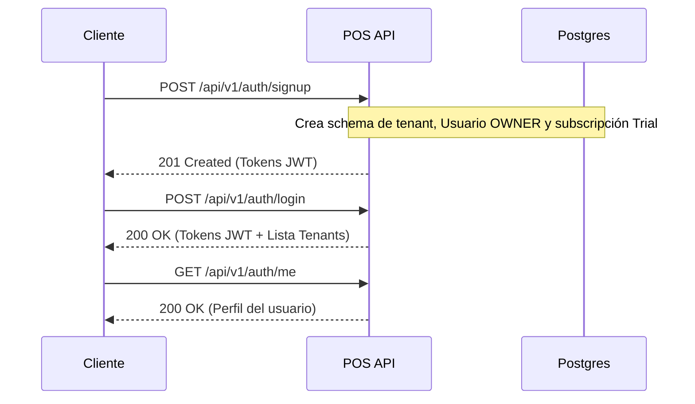
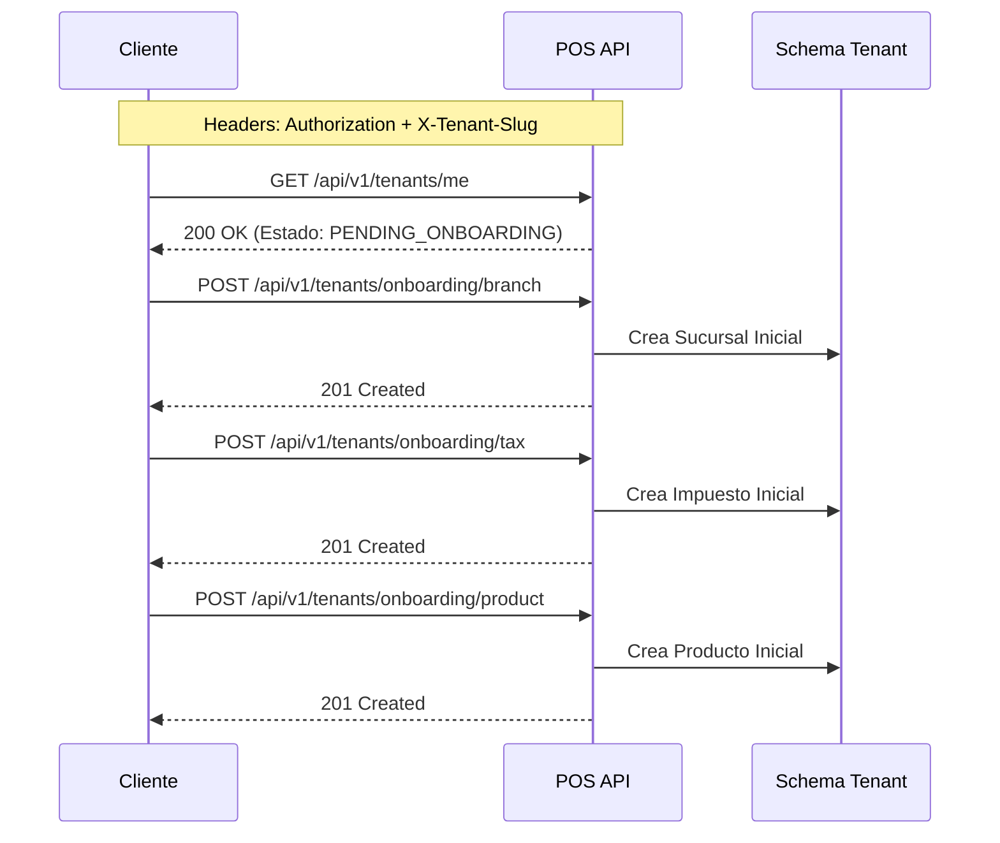
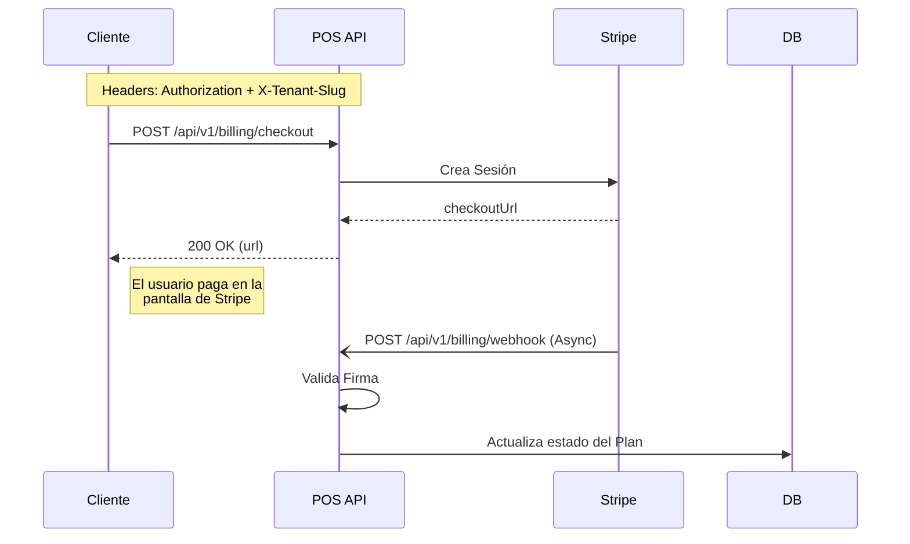

# POS SaaS - Flujo de Pruebas y Endpoints

Este documento describe el flujo operativo del sistema backend (API NestJS) y las acciones necesarias para probar la funcionalidad implementada.

## Pre-requisitos

```bash
# 1. Levantar servicios base
pnpm docker:up

# 2. Aplicar migraciones
pnpm --filter @pos/api prisma:migrate

# 3. Poblar base de datos con datos de prueba
pnpm --filter @pos/api db:seed

# 4. Iniciar API
pnpm --filter @pos/api dev
```

## Credenciales de Prueba (tras seed)

| Usuario | Email | Password | Rol |
|---------|-------|----------|-----|
| Admin | admin@demo.com | Admin123! | OWNER |
| Cajero | cajero@demo.com | Cajero123! | CASHIER |
| Manager | manager@demo.com | Manager123! | MANAGER |

**Tenants:**
- Mi Comercio Demo: `comercio-demo-1`
- Tienda Express: `comercio-demo-2`

---

## Entorno de Pruebas Rápidas (Swagger)

La API levanta automáticamente un portal de documentación interactiva Swagger.
Puedes usar esta UI para probar rápidamente los endpoints en desarrollo:

**URL de Swagger:** `http://localhost:3000/api/v1/docs`

> **Nota sobre autenticación en Swagger:** Para rutas protegidas, haz clic en el botón "Authorize" en Swagger e ingresa tu token JWT. Además, para los endpoints marcados con `@TenantRequired`, deberás incluir el `X-Tenant-Slug` en la configuración del endpoint en la UI de Swagger o se rechazará la petición.

---

## Arquitectura Multi-Tenant

El sistema requiere identificar de qué *tenant* (comercio) proviene cada petición en los módulos internos.

**Headers obligatorios para rutas protegidas internamente:**
- `Authorization: Bearer <accessToken>`
- `X-Tenant-Slug: <slug-del-comercio>` (ej: `mi-comercio`)

**¿De dónde saco el `X-Tenant-Slug`?**
Lo defines tú mismo al crear tu cuenta en el paso 1 (el campo `"tenantSlug"` del body en `/auth/signup`). También puedes verlo listado al hacer `GET /api/v1/auth/me` bajo la propiedad `tenants[0].slug`.

**¿Cómo lo envío?**
- **En Swagger:** Haz clic en el botón verde **"Authorize"** (arriba a la derecha). Verás dos cajas: una para tu token (`access-token`) y otra llamada `tenant-slug`. Pega tu slug allí y Swagger lo enviará automáticamente como header en cada prueba que hagas.
- **En Postman / Insomnia:** Ve a la pestaña "Headers" de tu petición, agrega una nueva fila con Key: `X-Tenant-Slug` y Value: el nombre de tu slug (ej. `mi-comercio`).

*(Alternativamente, en el código de producción, el sistema detecta el tenant automáticamente por el subdominio: `mi-comercio.localhost:3001` sin necesidad de este header)*

---

## 1. Flujo de Autenticación y Alta (Auth)

El primer paso es registrar un nuevo comercio. Esto creará el esquema aislado en PostgreSQL, el usuario propietario (`OWNER`) y una suscripción *Trial*.


```mermaid
sequenceDiagram
    participant Cliente
    participant API as POS API
    participant DB as Postgres

    %% Alta
    Cliente->>API: POST /api/v1/auth/signup
    Note over API,DB: Crea schema de tenant, Usuario OWNER y subscripción Trial
    API-->>Cliente: 201 Created (Tokens JWT)

    %% Login
    Cliente->>API: POST /api/v1/auth/login
    API-->>Cliente: 200 OK (Tokens JWT + Lista Tenants)

    %% Obtener Perfil
    Cliente->>API: GET /api/v1/auth/me
    API-->>Cliente: 200 OK (Perfil del usuario)
```

### Acciones y Endpoints a probar:

1. **Alta de comercio (Signup)**
   - **Endpoint:** `POST /api/v1/auth/signup`
   - **Body (JSON):**
     ```json
     {
       "email": "admin@comercio.com",
       "password": "Password123!",
       "tenantSlug": "mi-comercio",
       "tenantName": "Mi Comercio"
     }
     ```
   - **Resultado:** Retorna `accessToken` y `refreshToken`. Toma nota del token y del `tenantSlug`.

2. **Login (Para reingresar)**
   - **Endpoint:** `POST /api/v1/auth/login`
   - **Body:** `{ "email": "admin@comercio.com", "password": "Password123!" }`

3. **Verificar perfil de usuario**
   - **Endpoint:** `GET /api/v1/auth/me`
   - **Headers requeridos:** `Authorization: Bearer <accessToken>`

---

## 2. Flujo de Onboarding del Tenant

Un comercio recién creado comienza en estado `PENDING_ONBOARDING`. Debe configurar parámetros iniciales antes de poder operar (sucursal, impuesto y producto).


```mermaid
sequenceDiagram
    participant Cliente
    participant API as POS API
    participant DB as Schema Tenant

    Note over Cliente,API: Headers: Authorization + X-Tenant-Slug

    Cliente->>API: GET /api/v1/tenants/me
    API-->>Cliente: 200 OK (Estado: PENDING_ONBOARDING)

    Cliente->>API: POST /api/v1/tenants/onboarding/branch
    API->>DB: Crea Sucursal Inicial
    API-->>Cliente: 201 Created

    Cliente->>API: POST /api/v1/tenants/onboarding/tax
    API->>DB: Crea Impuesto Inicial
    API-->>Cliente: 201 Created

    Cliente->>API: POST /api/v1/tenants/onboarding/product
    API->>DB: Crea Producto Inicial
    API-->>Cliente: 201 Created
```

### Acciones y Endpoints a probar:
*(Recuerda enviar SIEMPRE los headers `Authorization` y `X-Tenant-Slug` en estos endpoints)*

1. **Crear Sucursal Inicial**
   - **Endpoint:** `POST /api/v1/tenants/onboarding/branch`
   - **Body:**
     ```json
     {
       "name": "Sucursal Central",
       "code": "CEN01",
       "address": "Av. Principal 123",
       "timezone": "America/Argentina/Buenos_Aires"
     }
     ```

2. **Crear Impuesto Inicial (ej. IVA)**
   - **Endpoint:** `POST /api/v1/tenants/onboarding/tax`
   - **Body:**
     ```json
     {
       "name": "IVA 21%",
       "rate": 0.21,
       "type": "PERCENT"
     }
     ```

3. **Crear Producto Inicial**
   - **Endpoint:** `POST /api/v1/tenants/onboarding/product`
   - **Body:**
     ```json
     {
       "name": "Producto de Prueba",
       "sku": "PRUEBA-01",
       "price": 1500,
       "trackStock": true
     }
     ```

4. **Verificar Estado del Tenant**
   - **Endpoint:** `GET /api/v1/tenants/me`
   - **Resultado:** Tras completar los 3 pasos, internamente el sistema sabe que el comercio ya ha completado su Onboarding inicial.

---

## 3. Flujo de Suscripción (Billing / Stripe)

La API se integra con Stripe para la gestión de pagos (Checkout) y modificación de tarjetas (Customer Portal).


```mermaid
sequenceDiagram
    participant Cliente
    participant API as POS API
    participant Stripe

    Note over Cliente,API: Headers: Authorization + X-Tenant-Slug

    Cliente->>API: POST /api/v1/billing/checkout
    API->>Stripe: Crea Sesión
    Stripe-->>API: checkoutUrl
    API-->>Cliente: 200 OK (url)

    Note right of Cliente: El usuario paga en la<br/>pantalla de Stripe

    Stripe-)API: POST /api/v1/billing/webhook (Async)
    API->>API: Valida Firma
    API->>DB: Actualiza estado del Plan
```

### Acciones y Endpoints a probar:

1. **Generar Link de Pago (Checkout)**
   - **Endpoint:** `POST /api/v1/billing/checkout`
   - **Body:** `{ "planId": "growth" }`
   - **Acción:** Retornará una URL que te llevará al flujo simulado de Stripe para introducir una tarjeta de prueba.

2. **Portal de Cliente de Stripe (Gestión de método de pago)**
   - **Endpoint:** `GET /api/v1/billing/portal`
   - **Acción:** Retornará una URL para el portal en donde el cliente puede modificar su tarjeta de crédito o cancelar su suscripción.

3. **Webhook de Stripe (Interno)**
   - **Endpoint:** `POST /api/v1/billing/webhook`
   - **Acción:** Este endpoint recibe los eventos desde Stripe. En local, puedes probarlo usando el CLI de Stripe para redirigir los eventos (`stripe listen --forward-to localhost:3000/api/v1/billing/webhook`).

---

## 4. Flujo Completo de Prueba Manual (con Seed Data)

Este flujo asume que ya ejecutaste `pnpm --filter @pos/api db:seed` y tienes datos de prueba en la base de datos.

### Paso 1: Login y Obtener Token

```bash
# Login como admin
curl -X POST http://localhost:3000/api/v1/auth/login \
  -H "Content-Type: application/json" \
  -d '{"email": "admin@demo.com", "password": "Admin123!"}'
```

**Response:**
```json
{
  "accessToken": "eyJhbGciOiJIUzI1NiIs...",
  "refreshToken": "eyJhbGciOiJIUzI1NiIs...",
  "user": { "id": "...", "email": "admin@demo.com", "name": "Admin Principal" },
  "tenants": [{ "slug": "comercio-demo-1", "role": "OWNER", "name": "Mi Comercio Demo" }]
}
```

### Paso 2: Configurar Headers en Swagger

1. Abre `http://localhost:3000/api/v1/docs`
2. Haz clic en "Authorize" (botón verde)
3. En "access-token" pega: `Bearer eyJhbGciOiJIUzI1NiIs...`
4. En "tenant-slug" pega: `comercio-demo-1`

### Paso 3: Probar Endpoints de Tenants

```bash
# Ver perfil del tenant
curl -X GET http://localhost:3000/api/v1/tenants/me \
  -H "Authorization: Bearer <token>" \
  -H "X-Tenant-Slug: comercio-demo-1"

# Ver sucursales
curl -X GET http://localhost:3000/api/v1/tenants/branches \
  -H "Authorization: Bearer <token>" \
  -H "X-Tenant-Slug: comercio-demo-1"

# Ver uso del tenant
curl -X GET http://localhost:3000/api/v1/tenants/usage \
  -H "Authorization: Bearer <token>" \
  -H "X-Tenant-Slug: comercio-demo-1"
```

### Paso 4: Probar Catálogo

```bash
# Listar productos
curl -X GET "http://localhost:3000/api/v1/catalog/products?limit=10" \
  -H "Authorization: Bearer <token>" \
  -H "X-Tenant-Slug: comercio-demo-1"

# Obtener producto por SKU
curl -X GET http://localhost:3000/api/v1/catalog/products/sku/ELEC-001 \
  -H "Authorization: Bearer <token>" \
  -H "X-Tenant-Slug: comercio-demo-1"

# Listar categorías
curl -X GET http://localhost:3000/api/v1/catalog/categories \
  -H "Authorization: Bearer <token>" \
  -H "X-Tenant-Slug: comercio-demo-1"
```

### Paso 5: Probar Clientes

```bash
# Listar clientes
curl -X GET "http://localhost:3000/api/v1/customers?limit=10" \
  -H "Authorization: Bearer <token>" \
  -H "X-Tenant-Slug: comercio-demo-1"

# Búsqueda rápida para POS
curl -X GET "http://localhost:3000/api/v1/customers/quick-search?q=12345678" \
  -H "Authorization: Bearer <token>" \
  -H "X-Tenant-Slug: comercio-demo-1"
```

### Paso 6: Probar Inventarios

```bash
# Listar stock por sucursal
curl -X GET "http://localhost:3000/api/v1/inventory/stocks?branchId=<branch-id>" \
  -H "Authorization: Bearer <token>" \
  -H "X-Tenant-Slug: comercio-demo-1"

# Productos con stock bajo
curl -X GET http://localhost:3000/api/v1/inventory/low-stock \
  -H "Authorization: Bearer <token>" \
  -H "X-Tenant-Slug: comercio-demo-1"
```

### Paso 7: Probar Ventas

```bash
# Listar ventas
curl -X GET "http://localhost:3000/api/v1/sales?limit=10" \
  -H "Authorization: Bearer <token>" \
  -H "X-Tenant-Slug: comercio-demo-1"

# Obtener venta por ID
curl -X GET http://localhost:3000/api/v1/sales/<sale-id> \
  -H "Authorization: Bearer <token>" \
  -H "X-Tenant-Slug: comercio-demo-1"
```

### Paso 8: Probar Reportes

```bash
# Dashboard KPIs
curl -X GET http://localhost:3000/api/v1/reports/dashboard \
  -H "Authorization: Bearer <token>" \
  -H "X-Tenant-Slug: comercio-demo-1"

# Ventas diarias
curl -X GET "http://localhost:3000/api/v1/reports/sales/daily?from=2024-01-01&to=2024-12-31" \
  -H "Authorization: Bearer <token>" \
  -H "X-Tenant-Slug: comercio-demo-1"

# Inventario valorizado
curl -X GET http://localhost:3000/api/v1/reports/inventory/valuation \
  -H "Authorization: Bearer <token>" \
  -H "X-Tenant-Slug: comercio-demo-1"

# Exportar a Excel
curl -X GET "http://localhost:3000/api/v1/reports/export/daily-sales" \
  -H "Authorization: Bearer <token>" \
  -H "X-Tenant-Slug: comercio-demo-1" \
  --output reporte.xlsx
```

### Paso 9: Probar Caja

```bash
# Sesión de caja abierta
curl -X GET http://localhost:3000/api/v1/cash/session/open \
  -H "Authorization: Bearer <token>" \
  -H "X-Tenant-Slug: comercio-demo-1"

# Listar sesiones de caja
curl -X GET "http://localhost:3000/api/v1/cash/sessions?limit=10" \
  -H "Authorization: Bearer <token>" \
  -H "X-Tenant-Slug: comercio-demo-1"
```

### Paso 10: Probar Configuración

```bash
# Obtener configuración del tenant
curl -X GET http://localhost:3000/api/v1/configuration \
  -H "Authorization: Bearer <token>" \
  -H "X-Tenant-Slug: comercio-demo-1"

# Listar impuestos
curl -X GET http://localhost:3000/api/v1/configuration/taxes \
  -H "Authorization: Bearer <token>" \
  -H "X-Tenant-Slug: comercio-demo-1"
```

---

## 5. Datos de Prueba (tras seed)

El seed crea automáticamente:

| Entidad | Cantidad | IDs/Valores |
|---------|----------|-------------|
| Tenants | 2 | `comercio-demo-1`, `comercio-demo-2` |
| Usuarios | 6 (3 por tenant) | admin@demo.com, cajero@demo.com, manager@demo.com |
| Sucursales | 6 (3 por tenant) | CEN01, NOR01, SUR01 |
| Categorías | 5 | cat-electro, cat-ropa, cat-alimentos, cat-hogar, cat-deportes |
| Impuestos | 5 | tax-igv (18%), tax-exento, tax-ivap (4%), etc. |
| Productos | 15 | ELEC-001 a DEPO-003 |
| Clientes | 5 | Carlos Pérez, María García, etc. |
| Proveedores | 3 | sup-distrib, sup-import, sup-local |
| Ventas | 10 (5 por tenant) | sale-tenant_comercio_demo_1-001 etc. |
| Sesiones de caja | 4 (2 por tenant) | Cerradas con arqueo |

---

## 6. Troubleshooting

### Errores Comunes

| Error | Causa | Solución |
|-------|-------|----------|
| `401 Unauthorized` | Token expirado o inválido | Login de nuevo |
| `404 Not Found` | Header `X-Tenant-Slug` falso o tenant no existe | Verificar slug con `GET /auth/me` |
| `403 Forbidden` | Rol insuficiente | Usar usuario con rol OWNER/ADMIN |
| `500 Internal Server Error` | DB no disponible | Verificar `docker ps` y estado de Postgres |

### Verificar Estado de Servicios

```bash
# Verificar Docker
docker ps

# Verificar API
curl http://localhost:3000/api/v1/docs

# Verificar logs de API
docker logs pos_postgres
```
